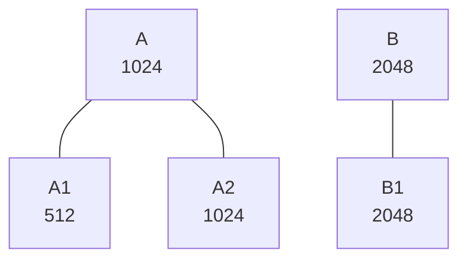

`Kubernetes` 에서는 컨테이너 단위로 resource를 할당할 수 있다.
여기에는 `memory`, `cpu`, `ephemeral-storage`, `hugepages` 등이 포함된다.
이 중에서 `cpu` 의 `requests`, `limits` 가 어떤 방식으로 적용이 되는지에 대해 알아볼 것이다.

## Linux Kernel

먼저 기본적으로 `Kubernetes`는 Linux Kernel의 `cgroup`을 사용하여 리소스 할당을 한다.
`cgroup`은 `control groups` 의 의미를 가지며 프로세서들의 자원(cpu, memory 등)을 제한하는 기술이다.

### CPU Share

`cpu.shares`는 CPU를 다른 group에 비해  상대적으로 얼마나 사용할 수 있는지를 나타내는 값이다.
예를 들어 하나의 CPU를 가지고 있고, 두개의 group이 있다고 해보자.
다음과 같이 `cpu.shares`를 설정했다고 생각해보자.

```none
A: 100
B: 200
```

`B`는 `A`보다 2배의 `cpu.shares` 값을 가지고 있다.
따라서 `B` group은 `A` group에 비해 두배 더 CPU를 사용할 수 있게 되고,
CPU 관점에서 보면 `B`는 2/3, `A`는 1/3 만큼의 CPU를 사용할 수 있다.

이번엔 좀 더 복잡한 예시를 보도록 하겠다.



```none
GROUP   SHARES
A       1024
B       2048
A1      512
A2      1024
B1      2048
```

위의 예시에서 첫번째 level의 group을 보면 `A`:`B` 는 `1`:`2` 로 `cpu.shares` 값이 정의되어 있다.
이 의미는 곧 두 group이 동시에 CPU time을 사용하려 할 때, `B` 는 `A` 에 비해 2배 더 CPU time을 사용한다는 의미이다.
만약 동시에 사용하지 않고 `A` 만 사용하려고 하는 순간에는 당연히 `A` 혼자 모든 CPU를 점유할 수 있게 된다.

두번째 level의 group을 보면 `A1` 과 `A2` 는 `A` 의 child group이다.
따라서 `A` 에게 할당된 CPU time에서 `A1` 과 `A2` 는 서로 `1`:`2` 의 비율로 CPU time을 가져간다.
`A1` 과 `A2` 만 동작하고 있다면, `A1` 의 CPU time은 다음과 같이 계산된다.

```none
# A CPU ratio
1024(A)/1024(A) = 1
# A1 CPU ratio in peer group
cpu.shares total:   512(A1)+1024(A2)=1536
A1 cpu.shares:      512
allocated CPU ratio: 512/1536 = 1/3
# A1 CPU in total
1 * 1/3(A1 cpu ratio in peer group) = 1/3
```

만약 `B` 도 함께 동작한다면 다음과 같이 계산한다.

```none
# A CPU ratio
1024(A)/1024(A)+2048(B) = 1/3
# A1 CPU ratio in peer group
cpu.shares total:   512(A1)+1024(A2)=1536
A1 cpu.shares:      512
allocated CPU ratio: 512/1536 = 1/3
# A1 CPU in total
1/3(A CPU ratio) * 1/3(A1 cpu ratio in peer group) = 1/9
```

### CFS Quota

`CFS`는 Completely Fair Scheduler의 약자이다.

`cpu.cfs_quota_us`, `cpu.cfs_period_us`로 CPU time에 제약을 건다.
먼저 각각을 소개하자면 `cpu.cfs_quota_us`는 CPU를 사용할 수 있는 시간을 의미한다.
`cpu.cfs_quota_us`를 `10000us`(=`10ms`)으로 설정할 경우 해당 group은 `10ms` 시간만큼만 CPU를 사용할 수 있다.
당연하게도, `cpu.cfs_quota_us`를 통해 설정된 사용가능한 CPU time은 특정 주기로 복구된다.
이를 `cpu.cfs_period_us`라고 한다.

다음의 예를 보자.

```none
cpu.cfs_quota_us:   10000
cpu.cfs_period_us:  100000
```

`cpu.cfs_period_us`가 `100000us`(=`100ms`)로 설정되었다.
그 말은 group이 사용한 CPU time이 `100ms` 주기로 초기화된다는 것을 의미한다.
`cpu.cfs_quota_us`는 `10000us`(=`10ms`)로 설정되었다.
따라서 group은 `100ms` 동안 `10ms`까지 CPU를 사용할 수 있다는 것을 의미하고,
CPU 관점에서 보았을 때 이는 `0.1 CPU`를 사용한다는 의미이다.

그렇다면 자신에게 주어진 quota를 다 사용했음에도 불구하고, CPU를 사용하려하면 어떻게 될까?
이 경우 다음 period 주기가 돌때까지 CPU를 사용하지 못하게 되며, 이를 `throttle`이라고 한다.

얼마나 `throttle`이 되었는지를 확인하려면 `cpu.stats`를 확인하면 된다.

## Kubernetes

이번에는 `Kubernetes`가 어떻게 위의 두가지를 이용하여 `cpu requests`와 `cpu limits`를 다루는지에 대해 알아볼 것이다.
`Kubernetes` 는 CPU에 대해서 `compressible` 한 자원이라고 해석한다.
반면 메모리는 임의로 줄일 수 없는 영역이기때문에 `uncompressible` 한 자원이다.

## CPU Requests

`Kubernetes` 는 `cpu.shares` 를 통해 할당된 `requests.cpu` 를 적용한다.

`Kubernetes` 는 `cpu requests` 값을 우선 `milicore` 단위로 환산한다. 
공식 docs에서는 `1 core` = `1000 milicore` 라고 명시되어 있다.
여기서 `milicore` 로 환산한 값을 1000으로 나누고 1024를 곱한다. 예를 들어 파드가 `requests.cpu` 값으로 `500m` 을 주었다면, `500/1000*1024 = 512` 계산식을 통해 `512`라는 값이 나오게 된다.
이 값을 `cgroup` 의 `cpu.shares` 값으로 사용한다.

앞서 말했듯이 `cpu.shares` 는 다른 group과의 상대적인 cpu time을 말하는 것이다. 따라서 만약 다른 group에서 큰 숫자로 `cpu.shares` 를 사용하게 된다면, 쿠버네티스에서 설정한 `requests.cpu` 값보다 적게 cpu time이 할당될 것이다.

다시 이러한 의문이 생길 수 있다.
상대적인 값으로 설정한 것들이 어떻게 쿠버네티스에서는 `requests.cpu` 의 의미로 사용되는 것일까?
이는 쿠버네티스에서 자체적으로 설정한 `requests.cpu` 즉, 각 노드에서의 `cpu.shares`값을 관리하기 때문이다.
쿠버네티스는 Allocatable한 cpu 갯수에 `1024` 를 곱하여  `cpu.shares` 값들의 합이 그 값을 넘을 수 없도록 관리한다.

예를 들어 10개의 cpu가 있는 노드라면 `cpu.shares` 의 합은 `10240` 을 넘을 수 없다.
이 상황에서 다음과 같이 `requests.cpu` 를 설정했다고 해보자.

```none
CONTAINER    CPU REQUESTS
A            1500m       
B            3500m       
C            5000m       
```

`A` 의 `cpu.shares` 값은 `1500/1000*1024 = 1536` 이다.
`B` 의 `cpu.shares` 값은 `3500/1000*1024 =  3584` 이다.
`C` 의 `cpu.shares` 값은 `5000/1000*1024 = 5120` 이다.
이 값들을 모두 합하면 `1536+3584+5120 = 10240` 이 된다.
이 경우 다른 group 에서 `cpu.shares` 값이 할당되지 않았다면, 상대적으로 `A`, `B`, `C` 컨테이너는 각각 `1.5`:`3.5`:`5` 의 비율로 cpu slice를 사용할 수 있다.
즉, 바꿔말하면 각각 `1.5 cpu`, `3.5 cpu`, `5 cpu` 를 사용할 수 있는 것이다.

`cpu.shares` 는 상대적인 값을 의미한다는 특징 떄문에, 쿠버네티스처럼 노드에서 최대 `cpu.shares` 의 합을 관리하지 않는다면 `cpu.shares` 값은 앞서 보았던것 처럼 `cpu requests` 의 의미를 가지기 어렵다.
원래 의미 그대로 단순히 상대적인 cpu slice 사용량을 의미할 뿐이다.

## CPU Limits

`Kubernetes`는  `CFS` 를 통해 설정된 `limits.cpu` 를 적용한다.

`CPU Requests` 에서 다루었던 것처럼 `CPU Limits` 도 값이 주어지면 이를 `milicore` 단위로 환산한다.
이 값을 통해 `cpu.cfs_quota_us` 를 설정한다.
`Kubernetes` 는 `cpu.cfs_period_us` 값을 `100000us` 로 고정시켜놓는다.
이 경우 `1 cpu` 까지 사용하고 싶다면 `cpu.cfs_quota_us` 를 동일한 값인 `100000us` 로 할당한다.
`1 cpu` = `1000 milicore` 이므로 결론적으로는 환산된 `milicore` 값에 100을 곱한다는 것을 알 수있다.

예를 들어, `limits.cpu` 로 `3` 을 할당했다고 생각해보자.
그러면 먼저 `milicore` 단위로 환산하게 되고 `3000m` 이라는 값이 나온다.
여기에 `100`을 곱한 `300000` 값이 `cpu.cfs_quota_us` 로 설정되게 된다.
이때 "`100ms` 시간동안 `3` 개의 코어를 온전히 사용한다 (`3 cpu` 에서 `100%` 로 사용중이다)"라고 해석하기보다는,
`100ms` 시간동안 사용할 수 있는 모든 cpu에서 사용된 cpu time의 합이 `300ms` 이다(`6 cpu` 에서 각각 `50%` 씩 사용할 수도 있다)라고 해석해야한다.
만약 이 시간보다 더 많이 CPU를 사용하려고 요청한다면, `throttle` 현상이 생길 것이다.
이는 `cpu.stat` 을 확인하면 알 수 있다.

그렇다면 `limits.cpu` 를 설정하지 않았을 때는 어떤 현상이 발생할까?
이 경우 `cpu.cfs_quota_us` 값이 `-1` 로 설정되며 이는 제한을 두지 않겠다는 의미이다.
따라서 자신이 사용할 수 있는 만큼 계속해서 CPU를 사용하게 될 것이다.

## 참조

* https://www.redhat.com/sysadmin/cgroups-part-two
* https://www.batey.info/cgroup-cpu-shares-for-kubernetes.html
* https://www.batey.info/cgroup-cpu-shares-for-docker.html
* https://medium.com/@betz.mark/understanding-resource-limits-in-kubernetes-cpu-time-9eff74d3161b

