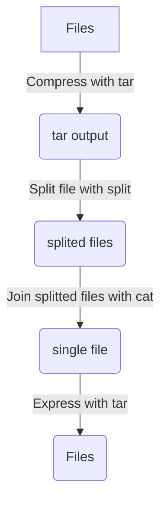

`Linux` 환경에서 압축파일을 분할하는 방법에 대해 알아볼 것이다.

## Prerequisite

* `tar` binary installed
* `split` binary installed
* `cat` binary installed

## How to split

다음은 이번에 할 압축분할에 대한 간단한 flow 이다.



### Compress with `tar`

먼저 우리가 알고있는 일반적인 방법으로 압축을 하여 하나의 파일로 만든다.

```sh
COMPRESSED_FILENAME=docker.tgz
SRC_FILES=folder
tar cvzf $COMPRESSED_FILENAME $SRC_FILES
```

### Split file with `split`

`split` 이라는 프로그램을 통해 하나의 파일을 여러개의 파일로 나눈다.
이 때 `-b` 옵션을 주면 얼만큼의 사이즈로 나눌지를 선택할 수 있다.
기타 다른 옵션들도 있으니 필요한 상황에 따라 옵션을 찾아보면 좋을 듯 하다.

```sh
FILESIZE=2G
SRC_FILENAME=docker.tgz
DST_FILENAME=docker.tgz.part
split -b $FILESIZE $SRC_FILENAME $DST_FILENAME
```

이제 `docker.tgz.part` 라는 prefix를 가진 파일들이 여러개 생길 것이다.
이 파일들의 사이즈는 `-b` 옵션으로 주었던 사이즈랑 일치하는 것을 확인할 수 있다.

### Join splitted files with `cat`

`cat` 은 일반적으로 파일의 내용을 출력할 때 사용한다.
이를 redirection과 함께 사용하여 `split` 으로 나누었던 파일들을 하나로 합친다.

```sh
SRC_FILENAME=docker.tgz.part
DST_FILENAME=docker.tgz
cat ${SRC_FILENAME}* >$DST_FILENAME
```

이렇게 하면 `DST_FILENAME` 으로 지정한 `docker.tgz` 파일이 생긴 것을 확인할 수 있다.

### Express with `tar`

이제 `tar` 를 통해 다시 압축해제하면 처음에 압축했던 파일들을 다시 확인할 수 있다.

```sh
FILE_NAME=docker.tgz
tar xvzf $FILE_NAME
```
